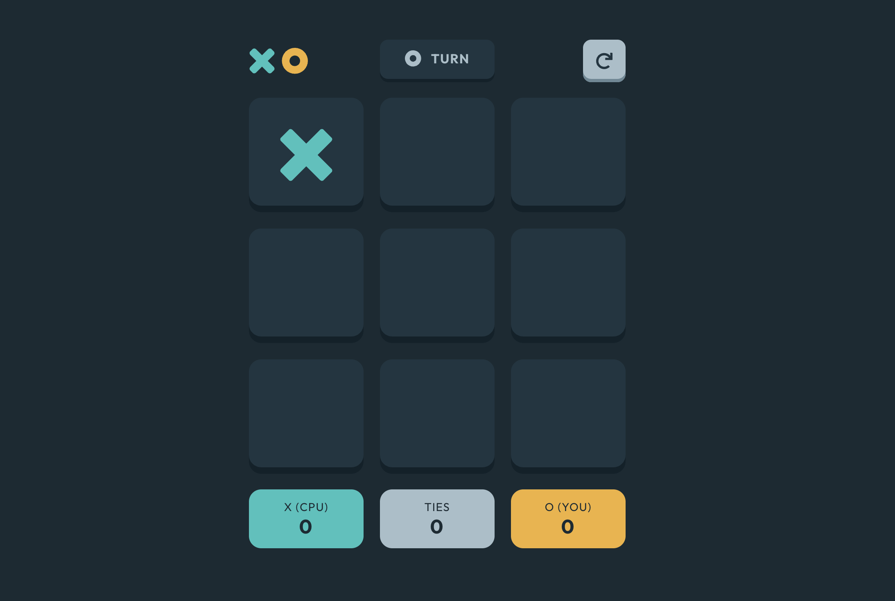

# Tic Tac Toe



## Overview
This is a Tic-Tac-Toe game that offers an interactive experience for players. It features two different game modes: playing solo against the computer or multiplayer against another person. The app adapts its layout to different screen sizes, providing an optimal experience on both desktop and mobile devices. It also includes hover states for all interactive elements to enhance the user interface.

## Features
-	Responsive Design: The game adjusts its layout depending on the user’s screen size, ensuring an optimal view on any device.
- Hover Effects: All interactive elements have hover states for better user interaction.
- Gameplay Modes:
- Solo vs. Computer: Players can compete against the computer in a solo mode.
-	Multiplayer: Two players can play against each other in a multiplayer mode.
-	Persistent Game State (Bonus 1): The game state is saved in the browser, allowing players to continue where they left off even after refreshing the page.
-	Smart Computer Opponent (Bonus 2): Instead of making random moves, the computer opponent is smarter, proactively blocking the player’s moves and attempting to win.

## Additional Features

- New Game Screen: The game either starts directly with the solo player game board or presents a new game menu where players can choose their mode. If a player chooses the new game menu, it will automatically assign the remaining mark to the second player.
-	Turn Order: The first player always starts the first round with X, and in each subsequent round, the starting player alternates between X and O.
-	Game Reset: If a player quits after a round, they are taken back to the new game menu. The restart icon in the top right corner opens a modal asking whether they want to reset the game or continue playing.

## Tech Stack
- React
- SASS
- Vite

### Running the Project
Start the development server:

```sh
npm run dev
```

The app will be available at `http://localhost:3000/`.

### Building for Production

To create an optimized production build, run:

```sh
npm run build
```

## License
This project is part of a [Frontend Mentor](https://www.frontendmentor.io) challenge and is intended for educational purposes.
